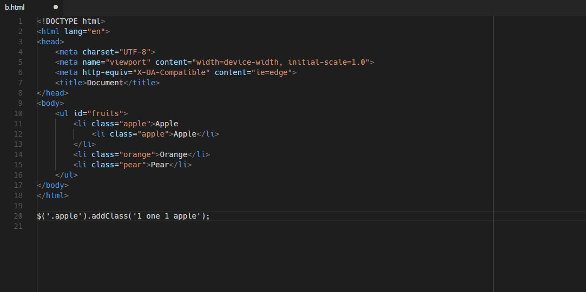

# Objective

Integrate cheerio with vscode editor to manipulate HTML, cheerio provide method like jQuery to manipulate the HTML.

## Features

1. Click View -> Command Palette (or Ctrl + Shift + P)
2. Highlight HTML
3. Execute `Cheerio: Eval Command`, for example: `$('.apple').addClass('apple2');`
4. Enter the API command
5. The resulting HTML will replace the highlighted HTML

## Requirements

- VSCode >= 1.2.3, cherrio is built inside this dependency, the current version is 1.0.0-rc

Please read [cheerio github](https://github.com/cheeriojs/cheerio) for API reference

## Release Notes

### 1.0.0 - 2018-05-29

Initial release